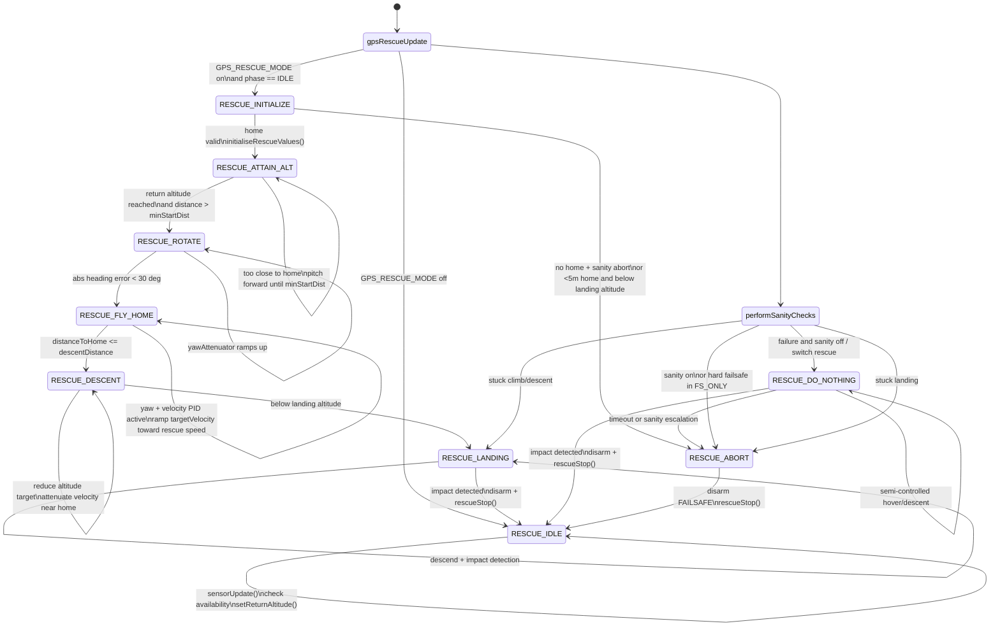
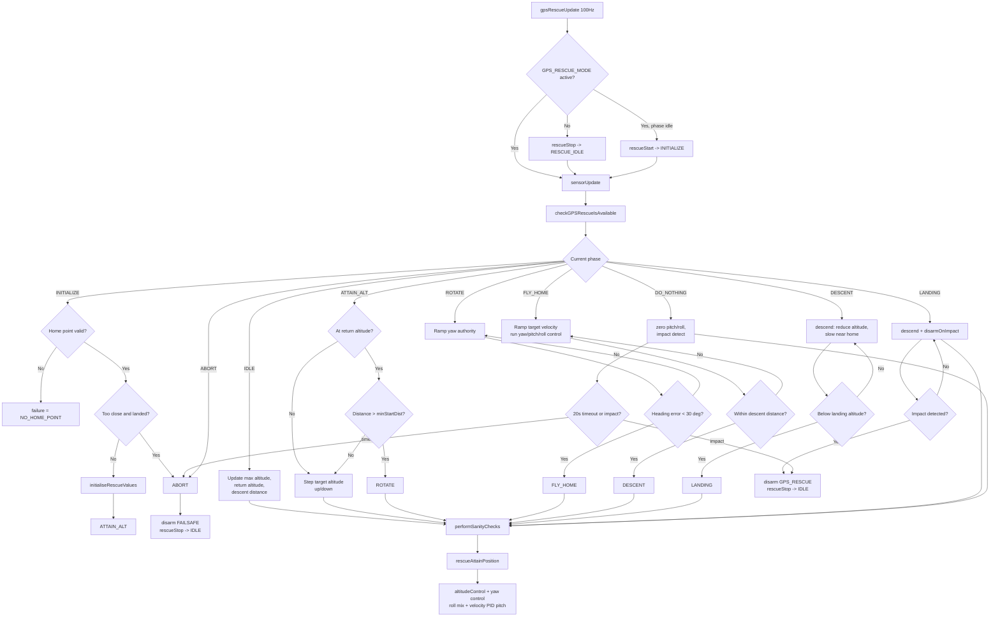

# GPS Rescue Multirotor Logic

Companion logic diagrams for `gps_rescue_multirotor.c`.

## State Machine

```mermaid
stateDiagram-v2
    [*] --> gpsRescueUpdate

    gpsRescueUpdate --> IDLE: GPS_RESCUE_MODE off
    gpsRescueUpdate --> INITIALIZE: GPS_RESCUE_MODE on\nand phase == IDLE

    IDLE: RESCUE_IDLE
    INITIALIZE: RESCUE_INITIALIZE
    ATTAIN_ALT: RESCUE_ATTAIN_ALT
    ROTATE: RESCUE_ROTATE
    FLY_HOME: RESCUE_FLY_HOME
    DESCENT: RESCUE_DESCENT
    LANDING: RESCUE_LANDING
    DO_NOTHING: RESCUE_DO_NOTHING
    ABORT: RESCUE_ABORT

    IDLE --> IDLE: sensorUpdate()\ncheck availability\nsetReturnAltitude()

    INITIALIZE --> ABORT: no home + sanity abort\nor <5m home and below landing altitude
    INITIALIZE --> ATTAIN_ALT: home valid\ninitialiseRescueValues()

    ATTAIN_ALT --> ATTAIN_ALT: climb/descend toward returnAltitude
    ATTAIN_ALT --> ROTATE: return altitude reached\nand distance > minStartDist
    ATTAIN_ALT --> ATTAIN_ALT: too close to home\npitch forward until minStartDist

    ROTATE --> ROTATE: yawAttenuator ramps up
    ROTATE --> FLY_HOME: abs heading error < 30 deg

    FLY_HOME --> FLY_HOME: yaw + velocity PID active\nramp targetVelocity toward rescue speed
    FLY_HOME --> DESCENT: distanceToHome <= descentDistance

    DESCENT --> DESCENT: reduce altitude target\nattenuate velocity near home
    DESCENT --> LANDING: below landing altitude

    LANDING --> LANDING: descend + impact detection
    LANDING --> IDLE: impact detected\ndisarm + rescueStop()

    DO_NOTHING --> DO_NOTHING: semi-controlled hover/descent
    DO_NOTHING --> ABORT: timeout or sanity escalation
    DO_NOTHING --> IDLE: impact detected\ndisarm + rescueStop()

    ABORT --> IDLE: disarm FAILSAFE\nrescueStop()

    gpsRescueUpdate --> performSanityChecks
    performSanityChecks --> DO_NOTHING: failure and sanity off / switch rescue
    performSanityChecks --> ABORT: sanity on\nor hard failsafe in FS_ONLY
    performSanityChecks --> LANDING: stuck climb/descent
    performSanityChecks --> ABORT: stuck landing
```

## Update Flow

```mermaid
flowchart TD
    A[gpsRescueUpdate 100Hz] --> B{GPS_RESCUE_MODE active?}
    B -- No --> C[rescueStop -> RESCUE_IDLE]
    B -- Yes, phase idle --> D[rescueStart -> INITIALIZE]
    B -- Yes --> E[sensorUpdate]

    C --> E
    D --> E

    E --> F[checkGPSRescueIsAvailable]
    F --> G{Current phase}

    G -->|IDLE| H[Update max altitude,\nreturn altitude,\ndescent distance]

    G -->|INITIALIZE| I{Home point valid?}
    I -- No --> J[failure = NO_HOME_POINT]
    I -- Yes --> K{Too close and landed?}
    K -- Yes --> L[ABORT]
    K -- No --> M[initialiseRescueValues]
    M --> N[ATTAIN_ALT]

    G -->|ATTAIN_ALT| O{At return altitude?}
    O -- No --> P[Step target altitude\nup/down]
    O -- Yes --> Q{Distance > minStartDist?}
    Q -- Yes --> R[ROTATE]
    Q -- No --> P

    G -->|ROTATE| S[Ramp yaw authority]
    S --> T{Heading error < 30 deg?}
    T -- Yes --> U[FLY_HOME]
    T -- No --> S

    G -->|FLY_HOME| V[Ramp target velocity\nrun yaw/pitch/roll control]
    V --> W{Within descent distance?}
    W -- Yes --> X[DESCENT]
    W -- No --> V

    G -->|DESCENT| Y[descend: reduce altitude,\nslow near home]
    Y --> Z{Below landing altitude?}
    Z -- Yes --> AA[LANDING]
    Z -- No --> Y

    G -->|LANDING| AB[descend + disarmOnImpact]
    AB --> AC{Impact detected?}
    AC -- Yes --> AD[disarm GPS_RESCUE\nrescueStop -> IDLE]
    AC -- No --> AB

    G -->|DO_NOTHING| AE[zero pitch/roll,\nimpact detect]
    AE --> AF{20s timeout or impact?}
    AF -- timeout --> L
    AF -- impact --> AD

    G -->|ABORT| L
    L --> AG[disarm FAILSAFE\nrescueStop -> IDLE]

    H --> AH[performSanityChecks]
    P --> AH
    R --> AH
    U --> AH
    X --> AH
    AA --> AH
    AB --> AH
    AE --> AH

    AH --> AI[rescueAttainPosition]
    AI --> AJ[altitudeControl + yaw control\nroll mix + velocity PID pitch]
```
